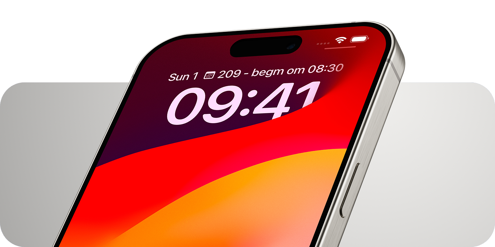

<div align="center">
  <!-- <a href="https://github.com/HarryDeKat/Discipulus">
    
  </a>
  <h3 align="center">Discipulus</h3>
  <br/> -->
  
  <br/><br/>
</div>

> [!NOTE]
> **Let op:** Discipulus is niet verbonden met, of onderdeel van Iddink Group.

<p align="center" style="display:flex; justify-content: space-between;">
  <a href="https://flutter.dev/"></a>
  <a href="https://apps.apple.com/us/app/discipulus/id6478711986"></a>
  <a href="https://play.google.com/store/apps/details?id=dev.harrydekat.discipulus"></a>
  <!-- <a href="https://play.google.com/store/apps/details?id=dev.harrydekat.Discipulus"></a> -->
  <!-- <a href="https://play.google.com/store/apps/details?id=dev.harrydekat.Discipulus"></a> -->
</p>

Discipulus is een open-source alternatief voor de Magister-app. Dit project is ontstaan uit mijn eigen frustraties, lichtjes uitgedrukt, met de originele app en mijn wens om iets te bouwen dat wel werkt zoals het hoort. Met Discipulus krijg je niet alleen een snellere en flexibele ervaring, maar ook een app die je helpt om alles wat belangrijk is in één oogopslag te zien. 🏆


## Waarom Discipulus?

- **Supersnelle opstarttijd** 🏃‍♂️: Vergeet lange laadtijden! Discipulus start sneller op dan de originele Magister-app.
- **Multi-platform** 🖥️: Discipulus is beschikbaar op Android, iOS, macOS, Windows & Linux. Overal zaligheid!
- **Alles-in-één overzichtspagina** 🗂️: Zie je rooster, berichten, cijfers en meer in één duidelijk overzicht.
- **Slimme agenda** 📅: Geen gedoe met gesplitste blokuren, duidelijke pauzes/tussenuren en kleuren laten je meteen zien wat belangrijk is.
- **Uitgebreid cijferoverzicht** 📊: Filter, sorteer en analyseer je cijfers, en kijk hoe je gemiddelde zich ontwikkelt.
- **Geavanceerd bijlagesysteem** 📂: Bewaar je bijlages offline en vind ze razendsnel terug, zelfs als je geen internet hebt.
- **Berichtensysteem** 📬: Lees, sorteer en beheer je berichten gemakkelijk met zelfs Spotlight intergratie op Apple!
- **Lokale opslag** 🌐: Discipulus is volledig offline te gebuiken, waardoor het ook supersnel is.
- **Widgets & Handoff** 🤝: Krijg direct inzicht in je volgende les zonder de app te openen en wissel moeiteloos tussen apparaten om precies daar verder te gaan waar je gebleven was.


## Enkele functies van Discipulus

### Platform intergratie

In Discipulus is rekening gehouden met de functies van je telefoon/computer. Er zijn bijvoorbeeld widgets voor iOS and macOS die je de juiste kant op kunnen leiden, je kan zoeken naar studiewijzers, mails en andere dingen via Spotlight en bestanden kunnen gemakkelijk worden opgeslagen door ze simpelweg uit het programma te slepen.  


### Overzichtspagina

De overzichtspagina is je persoonlijke dashboard. Hier zie je alles wat je nodig hebt in één oogopslag: je rooster, huiswerk, toetsen en belangrijke mededelingen. 

### Agenda

De agenda in Discipulus probeert je leven makkelijker te maken. Hij combineert automatisch blokuren, geeft pauzes visueel weer en markeert toetsen met opvallende kleuren. Zo kun je alles in één oogopslag zien. Als je een lesvrije dag hebt, is er een handige knop waarmee je snel naar de volgende dag kunt gaan met lessen. Ideaal, toch? Je kunt zelfs zelf wijzigingen aanbrengen, zoals het aanpassen van een locatie, het inplannen van huiswerk en toetsen of het toevoegen van notities. Deze zogeheten persoonlijke aanpassingen worden zelfs op al je apparaten via Magister, zonder derde partijen, gesynchroniseerd. 🤯



### Cijfers

Discipulus biedt een diepgaande analyse van je cijfers.  Bekijk je gemiddelde, het aantal voldoende cijfers, je hoogste en laagste cijfer, en filter op periode, datum, docent, vak en afgeronde cijfers. Cijfers van andere schooljaren zijn ook zichtbaar!  Je kunt grafieken aanpassen, cijfers doorzoeken, en badges toevoegen om gewicht, datum, en verandering in gemiddelde te tonen.  Bereken welk cijfer je nodig hebt voor een bepaald gemiddelde, en vice versa.  Zie de impact van elk cijfer op je gemiddelde en simuleer wat er gebeurt als je een cijfer verbetert. 📈


### Berichten

In Discipulus heb je al je berichten netjes op een rijtje. Sorteer ze per maand, filter op ongelezen, en zoek snel door je berichten heen. Stuur bijlagen naar klasgenoten of docenten door te delen via Discipulus of sla een bericht op als concept om er later op een ander apparaat aan verder schrijven. Heb je een Apple-apparaat? Dan kun je zelfs Spotlight gebruiken om je berichten te doorzoeken. Je kunt zelfs AI-gegenereerde samenvattingen van je berichten bekijken, zodat je snel de kern van elk bericht begrijpt. ✉️


### Bijlagesysteem

Je kunt bijlages offline opslaan, hernoemen, favorieten markeren en ze makkelijk delen. Op Windows, macOS en iOS is er ook ondersteuning voor zogeheten virtuele bestanden, wat betekent dat je bestanden niet eens hoeft te downloaden om ze in een andere app (zoals ChatGPT 😉) te slepen. 🖇️


### Studiewijzers

Met Discipulus kun je je studiewijzers helemaal naar wens indelen. Voeg favorieten toe, verander titels, of stel icoontjes in om ze nog sneller te vinden. Zelfs aan de digibete docent die niet weet wat een studiewijzer onderdelen zijn is gedacht, je kan namelijk studiewijzer groepjes/mapjes maken. Je kunt ze zelfs doorzoeken, zowel in de app als via Spotlight op iOS en macOS. 📝


### Activiteiten

Schrijf je direct in voor activiteiten, sorteer op naam of datum, en filter op verplicht/optioneel. Filter sub-activiteiten op Magister volgorde, alfabetisch, datum en populariteit. Zoek en filter op volle activiteiten of alleen de activiteiten waarvoor je bent ingeschreven. Inschrijven is zo simpel als één knop indrukken. 🎉


## Installatie

Discipulus is beschikbaar voor **Windows**, **macOS**, **Linux**, **Android**, en **iOS**. De makkelijkste manier om de app te installeren is via de officiële stores, maar als je wat technische skills hebt, kun je de app ook zelf bouwen met Flutter. Hier is hoe:

```bash
git clone https://github.com/DiscipulusApp/Discipulus.git
cd discipulus
flutter build <platform>
```

Voor meer details over het bouwen voor jouw platform, kun je het beste de [officiële Flutter-gids](https://flutter.dev/docs/get-started/install) checken.

## Wil je Bijdragen? Super!

Ik waardeer elke bijdrage aan Discipulus enorm. Hier zijn een paar dingen om in gedachten te houden:

- **Probeer het eerst zelf**: Lukt iets niet? Probeer het dan eerst zelf op te lossen. Dit is dé manier om te leren en het geeft ook een goed gevoel als het lukt! 💪
- **Blijf binnen de stijl**: Zorg ervoor dat je ontwerp past binnen de stijl van Material 3.
- **Volg de linter**: Houd je aan de Flutter linter-regels en zorg voor goed georganiseerde code. Als je een pull-request indient, help ik je graag verder!

## Bekende Problemen

- **Bekend Probleem**: Push-notificaties werken momenteel niet optimaal vanwege beperkingen met de Magister-API. De huidige notificaties zijn gebaseerd op achtergrondverwerking, wat minder efficiënt is. Als je een oplossing kunt vinden om push-notificaties te integreren, dan zou dat geweldig zijn! 🚀

## Bedankjes

Discipulus is geïnspireerd door en met dank aan de geweldige projecten [Gemairo](https://github.com/gemairo/app) en [Argo](https://github.com/Argo-Client/App).

## Contact

Heb je vragen of suggesties? Je kunt me altijd bereiken via Discord (HarryDeKat#4914) of per e-mail: [discipulus@harrydekat.dev](mailto:discipulus@harrydekat.dev). 

En vergeet niet om het project te checken op GitHub: [Discipulus op GitHub](https://github.com/HarryDeKat/Discipulus).